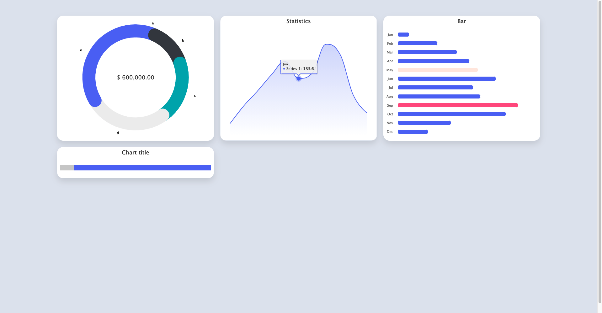

# CustomChart



This project was generated with [Angular CLI](https://github.com/angular/angular-cli) version 12.0.2.

## Development server

Run `ng serve` for a dev server. Navigate to `http://localhost:4200/`. The app will automatically reload if you change any of the source files.

## Code scaffolding

Run `ng generate component component-name` to generate a new component. You can also use `ng generate directive|pipe|service|class|guard|interface|enum|module`.

## Build

Run `ng build` to build the project. The build artifacts will be stored in the `dist/` directory.

## Running unit tests

Run `ng test` to execute the unit tests via [Karma](https://karma-runner.github.io).

## Running end-to-end tests

Run `ng e2e` to execute the end-to-end tests via a platform of your choice. To use this command, you need to first add a package that implements end-to-end testing capabilities.

## Further help

To get more help on the Angular CLI use `ng help` or go check out the [Angular CLI Overview and Command Reference](https://angular.io/cli) page.

**Deploy your Angular app to GitHub pages directly from the Angular CLI! 🚀**

## 🚀 Quick Start (local development) <a name="quickstart-local"></a>

This quick start assumes that you are starting from scratch.
If you already have an existing Angular project on GitHub, skip step 1 and 2.

1. Install the latest version of the Angular CLI globally
   and create a new Angular project.

   ```sh
   npm install -g @angular/cli
   ng new your-angular-project --defaults
   cd your-angular-project
   ```

2. By default the Angular CLI initializes a Git repository for you.  
   To add a new remote for GitHub, use the `git remote add` command:

   ```sh
   git remote add origin https://github.com/<username>/<repositoryname>.git
   ```

   Hints:

   - Create a new empty GitHub repository first.
   - Replace `<username>` and `<repositoryname>` with your username from GitHub and the name of your new repository.
   - Please enter the URL `https://github.com/<username>/<repositoryname>.git` into your browser – you should see your existing repository on GitHub.
   - Please double-check that you have the necessary rights to make changes to the given project!

3. Add `angular-cli-ghpages` to your project.

   ```sh
   ng add angular-cli-ghpages
   ```

4. Deploy your project to GitHub pages with all default settings.
   Your project will be automatically built in production mode.

   ```sh
   ng deploy --base-href=/<repositoryname>/
   ```

   Which is the same as:

   ```sh
   ng deploy your-angular-project --base-href=/<repositoryname>/
   ```

   Please be aware of the `--base-href` option. It is necessary when your project will be deployed to a non-root folder. See more details below.

5. Your project should be available at `https://<username>.github.io/<repositoryname>`.  
   Learn more about GitHub pages on the [official website](https://pages.github.com/).

## 🚀 Continuous Delivery <a name="continuous-delivery"></a>

If you run this command from a CI/CD environment, the deployment will most likely not work out of the box.
For security reasons, those environments usually have read-only privileges or you haven't set up Git correctly.
Therefore you should take a look at ["personal access tokens" `GH_TOKEN`](https://help.github.com/articles/creating-an-access-token-for-command-line-use/) (which works everywhere) and the ["installation access token" `GITHUB_TOKEN`](https://help.github.com/en/actions/automating-your-workflow-with-github-actions/authenticating-with-the-github_token) (which is exclusively provided by GitHub actions).
In short: a token replaces username and password and is a safer choice because a token can be revoked at any time.

All you need to do is to set an environment variable called `GH_TOKEN` (or `PERSONAL_TOKEN`) in your CI/CD environment.
For GitHub Actions, you can also use the `GITHUB_TOKEN` which provides more security and requires no additional setup.
All the tokens only work if the remote repository uses the HTTPS scheme.
Tokens are generally not supported for Git over SSH.

If the current working directory is already a git repository, you don't need to specify the repository again. The current remote repository with the name `origin` will be used in this case.
You can also override the repository setting using the `--repo` option.

If you specify all the three options (`--repo`, `--name` and `--email`), then angular-cli-ghpages will also work in directories that are not under version control at all.

```sh
ng deploy --repo=https://github.com/<username>/<repositoryname>.git --name="Your Git Username" --email=your.mail@example.org
```

(replace `<username>` and `<repositoryname>` with your username from GitHub and the name of your repository)

> **⚠️Important**
>
> Please **do not disable the silent mode** if you use tokens, otherwise people could read them in the output logs.
> If you are sure that your CI/CD provider does not display secrets on the console (this applies to CircleCI / Travis CI and Github Actions), you are welcome to disable silent mode.

> **ℹ️ Note for GitHub Actions**

A list of all avaiable options is also available [here](https://github.com/angular-schule/angular-cli-ghpages/blob/master/src/deploy/schema.json).

Example:

```sh
ng deploy --base-href=https://angular-schule.github.io/angular-cli-ghpages/ --name="Angular Schule Team" --email=team@angular.schule
```

becomes

```json
"deploy": {
  "builder": "angular-cli-ghpages:deploy",
  "options": {
    "baseHref": "https://angular-schule.github.io/angular-cli-ghpages/",
    "name": "Angular Schule Team",
    "email": "team@angular.schule"
  }
}
```

Now you can just run `ng deploy` without all the options in the command line! 😄

> **ℹ️ Hint**
>
> You can always use the [--dry-run](#dry-run) option to verify if your configuration is right.
> The project will build but not deploy.

## 🌍 Environments <a name="environments"></a>

We have seen `angular-cli-ghpages` running on various environments, like Travis CI, CircleCi or Github Actions.
Please share your knowledge by writing an article about how to set up the deployment.

# custom-chart-angular-12
